```mermaid
graph TB
    subgraph "Client Layer"
        A[📱 API Clients]
        B[🌐 Frontend Applications] 
        C[🔧 Testing Tools]
    end
    
    subgraph "Controller Layer"
        D[🎮 User Controller]
        E[🚄 Train Controller]
        F[🎫 Booking Controller]
    end
    
    subgraph "Service Layer"
        G[⚙️ User Service]
        H[⚙️ Train Service] 
        I[⚙️ Booking Service]
        J[🛡️ Validation Service]
    end
    
    subgraph "Repository Layer" 
        K[🗄️ User Repository]
        L[🗄️ Train Repository]
        M[🗄️ Booking Repository]
    end
    
    subgraph "Database Layer"
        N[(🛢️ MySQL Database)]
        O[📊 JPA/Hibernate]
    end
    
    A --> D
    B --> E  
    C --> F
    D --> G
    E --> H
    F --> I
    G --> J
    H --> J
    I --> J
    G --> K
    H --> L
    I --> M
    K --> O
    L --> O
    M --> O
    O --> N
    
    style A fill:#ff6b6b
    style B fill:#4ecdc4
    style C fill:#45b7d1
    style D fill:#96ceb4
    style E fill:#feca57
    style F fill:#ff9ff3
    style G fill:#48dbfb
    style H fill:#54a0ff
    style I fill:#5f27cd
    style J fill:#ff6348
    style K fill:#00d2d3
    style L fill:#e17055
    style M fill:#a29bfe
    style N fill:#fd79a8
    style O fill:#fdcb6e
```

# 🚉 **TrainMate** – Online Ticketing Platform

<div align="center">
  
</div>

<div align="center">
  
</div>

<br>

<div align="center">
  
  
  
  
  
</div>

<br>

<div align="center">
  
</div>

---

<div align="center">
  <h2>
    
    <b>What is TrainMate?</b>
    
  </h2>
</div>

<div align="center">
  
</div>

**TrainMate** is a **robust RESTful backend system** designed for railway ticket booking operations. Built with enterprise-grade architecture, it efficiently handles user management, train operations, and booking processes with bulletproof reliability.

<div align="center">

### 🎯 **Core System Capabilities**
*Professional backend solution for modern railway booking*

</div>

<table align="center">
<tr>
<td align="center" width="25%">

<br><b>🔐 User Management</b>
</td>
<td align="center" width="25%">

<br><b>🚄 Train Operations</b>
</td>
<td align="center" width="25%">

<br><b>🎫 Booking System</b>
</td>
<td align="center" width="25%">

<br><b>❌ Cancellation</b>
</td>
</tr>
</table>

---

<div align="center">
  
  <br>
  <h2><b>🏗️ System Architecture & Features</b></h2>
</div>

<div align="center">
  
</div>

### 🎯 **Core Implementation Features**

<table>
<tr>
<td width="50%" valign="top">

<div align="center">

</div>

### 🌐 **RESTful Backend System**
```diff
+ ✅ Complete user registration & authentication
+ ✅ Comprehensive train schedule management  
+ ✅ Advanced ticket booking operations
+ ✅ Seamless cancellation processing
```

### 🏛️ **Clean Architecture Pattern**
```diff
+ 🎮 Controller Layer - HTTP request handling
+ ⚙️ Service Layer - Business logic processing
+ 🗄️ Repository Layer - Data access operations
+ 🛢️ Clean separation of concerns
```

</td>
<td width="50%" valign="top">

<div align="center">

</div>

### 🧠 **Business Logic & Validations**
```diff
+ 🪑 Intelligent seat availability checking
+ 📊 Real-time booking status management
+ ✅ Data integrity & validation enforcement
+ 🛡️ Reliability for real-world applications
```

### 🗄️ **Database Integration**
```diff
+ 💾 MySQL database with JPA/Hibernate
+ 🔄 Persistent storage architecture
+ ⚡ Efficient data retrieval operations
+ 📋 Optimized train schedules & booking storage
```

</td>
</tr>
</table>

---

<div align="center">
  
  <br>
  <h2><b>🛠️ Technology Stack</b></h2>
</div>

<div align="center">

### **🏗️ Backend Technologies**

| **Category** | **Technology** | **Purpose** | **Implementation** |
|:------------:|:--------------:|:-----------:|:------------------:|
| **Core Language** |  | Backend development & business logic | `Complete Implementation` |
| **Framework** |  | RESTful application framework | `Full Integration` |
| **ORM** |  | Object-relational mapping | `JPA Implementation` |
| **API Architecture** |  | Web service communication | `RESTful Design` |
| **Database** |  | Data persistence & management | `Production Ready` |

</div>

---

<div align="center">
  
  <br>
  <h2><b>🔄 System Architecture Flow</b></h2>
</div>

<div align="center">



</div>

---

<div align="center">
  
  <br>
  <h2><b>💡 System Workflow</b></h2>
</div>

<div align="center">
  
</div>

### 📱 **Complete Booking Process**

```mermaid
graph TD
    A[👤 User Registration/Login] --> B[🔍 Train Search Request]
    B --> C[📋 Available Trains Display]
    C --> D[🎫 Booking Request]
    D --> E{🪑 Seat Available?}
    E -->|✅ Yes| F[✅ Booking Confirmed]
    E -->|❌ No| G[❌ Booking Failed]
    F --> H[💾 Database Update]
    G --> I[🔄 Try Different Train]
    H --> J[📧 Confirmation Response]
    I --> B
    
    style A fill:#ff6b6b,stroke:#333,stroke-width:3px,color:#fff
    style B fill:#4ecdc4,stroke:#333,stroke-width:3px,color:#fff
    style C fill:#45b7d1,stroke:#333,stroke-width:3px,color:#fff
    style D fill:#96ceb4,stroke:#333,stroke-width:3px,color:#fff
    style E fill:#feca57,stroke:#333,stroke-width:3px,color:#fff
    style F fill:#48dbfb,stroke:#333,stroke-width:3px,color:#fff
    style G fill:#ff9ff3,stroke:#333,stroke-width:3px,color:#fff
    style H fill:#54a0ff,stroke:#333,stroke-width:3px,color:#fff
    style I fill:#5f27cd,stroke:#333,stroke-width:3px,color:#fff
    style J fill:#00d2d3,stroke:#333,stroke-width:3px,color:#fff
```

<div align="center">



</div>

### 🔄 **Cancellation Process**

```mermaid
graph LR
    A[❌ Cancellation Request] --> B[🔍 Booking Validation]
    B --> C[✅ Valid Booking?]
    C -->|Yes| D[🔄 Update Seat Status]
    C -->|No| E[❌ Invalid Request]
    D --> F[💾 Database Update]
    F --> G[📧 Cancellation Confirmed]
    
    style A fill:#ff6b6b
    style B fill:#4ecdc4
    style C fill:#feca57
    style D fill:#48dbfb
    style E fill:#ff9ff3
    style F fill:#54a0ff
    style G fill:#00d2d3
```

<div align="center">



</div>

---

<div align="center">
  
  <br>
  <h2><b>🏆 Key System Strengths</b></h2>
</div>

<div align="center">
  
| 🏗️ **Architecture** | 💾 **Data Management** | 🛡️ **Reliability** | ⚡ **Performance** |
|:---:|:---:|:---:|:---:|
| **Clean MVC Pattern** | **JPA/Hibernate Integration** | **Business Logic Validation** | **Optimized Database Queries** |
| Controller-Service-Repository | Persistent Storage Solution | Seat Availability Checks | Efficient Data Retrieval |
| Separation of Concerns | MySQL Database Integration | Real-world Applicability | RESTful API Design |

</div>

### 🎯 **Production-Ready Features**

<div align="center">

```diff
@@                    SYSTEM CAPABILITIES                    @@
+ 🔐 Complete User Registration & Authentication System
+ 🚄 Comprehensive Train Schedule Management
+ 🎫 Advanced Ticket Booking with Seat Management
+ ❌ Seamless Cancellation with Status Updates
+ 🛡️ Business Logic Validations for Data Integrity
+ 💾 Persistent Storage with MySQL & JPA/Hibernate
+ 🌐 RESTful API Architecture for Scalability
+ 🏗️ Clean Code Structure for Maintainability
```

</div>

---

<div align="center">
  
  <br>
  <h2><b>🚀 Future Enhancement Roadmap</b></h2>
</div>

<div align="center">

| **Phase** | **Innovation** | **Description** | **Timeline** |
|:---------:|:--------------:|:---------------:|:------------:|
| **🎯 Phase 1** | 💳 **Payment Gateway** | Razorpay, PayPal, UPI Integration | `Q1 2026` |
| **📱 Phase 2** | 🔖 **QR Code Tickets** | Digital tickets with QR verification | `Q2 2026` |
| **🌐 Phase 3** | 🖥️ **Frontend Portal** | React-based user interface | `Q3 2026` |
| **📊 Phase 4** | 🎛️ **Admin Dashboard** | Railway operator management system | `Q4 2026` |
| **🔔 Phase 5** | 📲 **Smart Notifications** | AI-powered SMS/Email alerts | `Q1 2027` |

</div>

---

<div align="center">
  
  <br>
  <h2><b>🛠️ Installation & Setup</b></h2>
</div>

<div align="center">
  
</div>

### **🔧 Prerequisites**
```bash
✅ Java 11+ (Recommended for Spring Boot)
✅ Spring Boot Framework
✅ MySQL Database Server
✅ Maven Build Tool
✅ IDE (IntelliJ IDEA/Eclipse)
```

### **⚡ Quick Start**
```bash
# 🚀 Clone the repository
git clone https://github.com/pradeep6696/TrainMate.git

# 📂 Navigate to project directory  
cd TrainMate

# 📦 Install dependencies
mvn clean install

# 🔥 Start the application
mvn spring-boot:run

# 🌟 Server runs at: http://localhost:8080
```

---

<div align="center">
  
  <br>
  <h2><b>📊 API Endpoints</b></h2>
</div>

### **🌐 RESTful API Structure**

<div align="center">

| **Method** | **Endpoint** | **Description** | **Functionality** |
|:----------:|:------------:|:---------------:|:-----------------:|
| `POST` | `/api/users/register` | 👤 User Registration | Create new account |
| `POST` | `/api/users/login` | 🔐 User Authentication | Login validation |
| `GET` | `/api/trains/search` | 🔍 Train Search | Find available trains |
| `POST` | `/api/bookings/create` | 🎫 Create Booking | Book train tickets |
| `DELETE` | `/api/bookings/{id}` | ❌ Cancel Booking | Cancel existing bookings |

</div>

---

<div align="center">
  
  <br>
  <h2><b>👨‍💻 About The Developer</b></h2>
</div>

<div align="center">
  
</div>

<div align="center">

### **🌟 Gadi Pradeep Chandra**
*🚀 Java Full Stack Developer*

[](https://www.linkedin.com/in/gadi-pradeep-chandra/)
[](https://github.com/pradeep6696)
[](mailto:gadipradeepchandra2005@gmail.com)

**🎓 Education:** Computer Science Engineering @ Lovely Professional University  
**📍 Location:** Visakhapatnam, Andhra Pradesh, India  
**💼 Specialization:** Java Backend Development & System Architecture  
**🏆 Goal:** Building scalable enterprise applications

</div>

---

<div align="center">
  
  <br>
  <h2><b>📜 Project Information</b></h2>
</div>

<div align="center">

```
📋 Available for:
    ✅ Educational purposes
    ✅ Portfolio demonstration  
    ✅ Code review & learning
    ✅ Open source contributions

📅 Development Timeline: July 2025
🏗️ Architecture: RESTful Backend System
💾 Database: MySQL with JPA/Hibernate
```

</div>

---

<div align="center">
  
</div>

<div align="center">
  
  <br><br>
  
  <h2><b>⭐ Star This Repository If You Found It Helpful! ⭐</b></h2>
  
  <p><i>"Clean code always looks like it was written by someone who cares"</i> - Robert C. Martin</p>
  
  <h3>🚀 Built with ❤️ using Java, Spring Boot & MySQL 🚀</h3>
  
  
  
</div>
